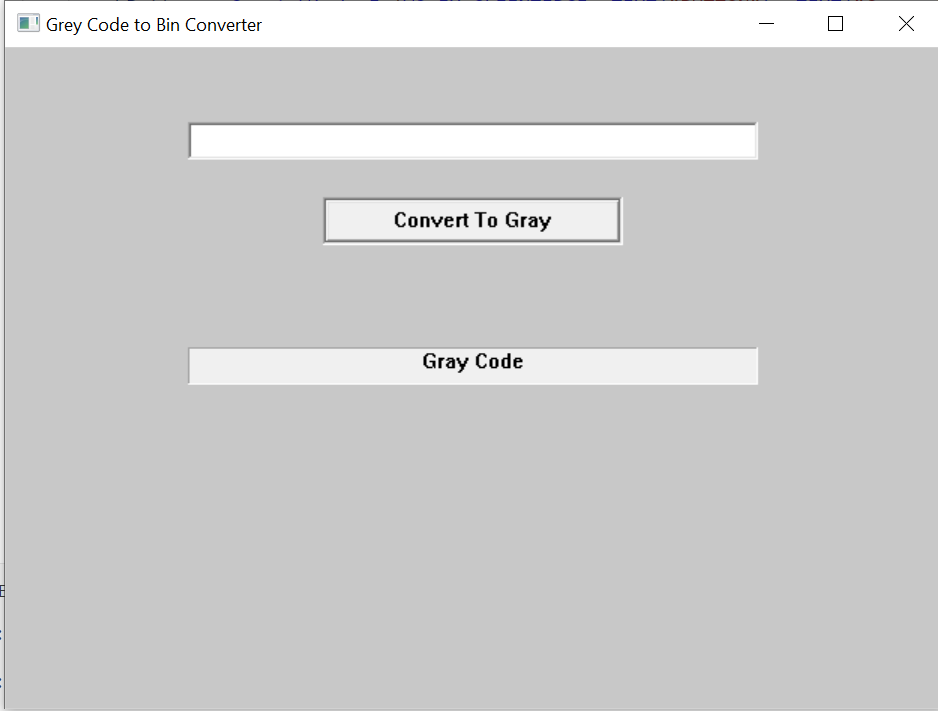

# BinToGray
Program to Convert binary number to gray code.
The program uses Win32 api to create user interface.Therefore, program is only supported on Windows

## How to run
```bash
$ git clone 
$ cd BinToGray
$ g++ -o binToGray binToGray.cpp
$ ./binToGray
```

## User interface

